# COVID19
A Canada-first breakdown and analysis of the COVID19 pandemic. The data are from John-Hopkins University CSSE. Data are updated at UTC+0 daily. These plots thus reflect the previous day's complete data. This date is in the title with the date generated in the footer.

https://github.com/CSSEGISandData/COVID-19

List of figures:
- [Canada](#canada)
- [Province testing & hospitalization](#province)
- [Global](#global)
- [United States](#us)

# Canada

**Figure 1**: Canada per-province cases, days since 25th case. 

**Figure 2**: Time series of daily reported infected cases, per-province. 

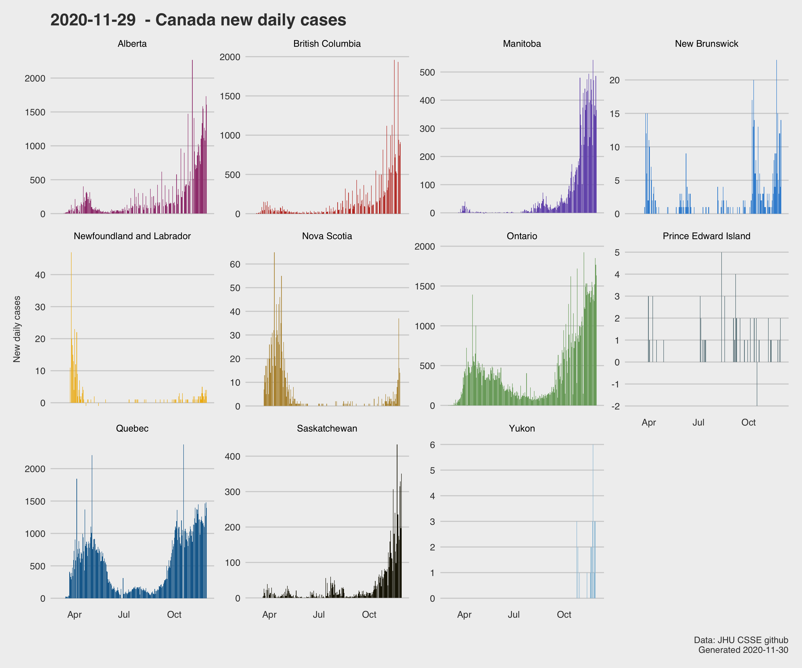
**Figure 3**: Per-province, daily new reported infected cases.

As provinces' growth rates slow and hasten, the rate of change of these rates can be useful for quantifying if the situation is getting better or worse.

This below figure shows a 10-day moving window calculation of the growth rate of covid19 cases, expressed as a percentage growth rate. 

Specifically, a linear fit to `log(value)`  is calculated using a 10-day moving window. The slope of this line is expressed as a doubling rate via `log(2)/log(slope)`.  The days to double are then converted to a growth rate in percentage. This is then plotted with time. It's essentially the change in time of a moving window first derivative. The moving window approach is used to help filter out some of the noise in data, e.g., when there is no reporting over weekends, etc.

**Figure 4**: 10-day moving window rate of change of growth for provinces. The reference 2% rate is approximately South Korea's rate.

A method to detect if a country/province has fallen off the exponential growth part of a logistic curve was suggested by [Minute Physics "How To Tell If We're Beating COVID-19"](https://www.youtube.com/watch?v=54XLXg4fYsc). The idea is if an area is currently following exponential growth, then the new daily cases as well as the cumulative cases both will increase exponentially. Plotting the two against each other, on log axes, results in a straight line. Thus, if the daily case growth is no longer exponential, there is a deviation from this straight line. In this case, weekly growth is used to help filter out the sampling noise.

**Figure 5**: New weekly case growth versus cumulative growth. Deviation from linear line suggests a move from exponential growth.

Comparing per capita numbers between countries has a lot of uncertainty due to population being just one of many factors that influences a country's response. However, comparing between provinces in Canada on a per capita basis shows a significant correlation between province population and cumulative cases. The below plot uses a 7-day rolling mean to filter some of the sampling noise and is per 100k population.

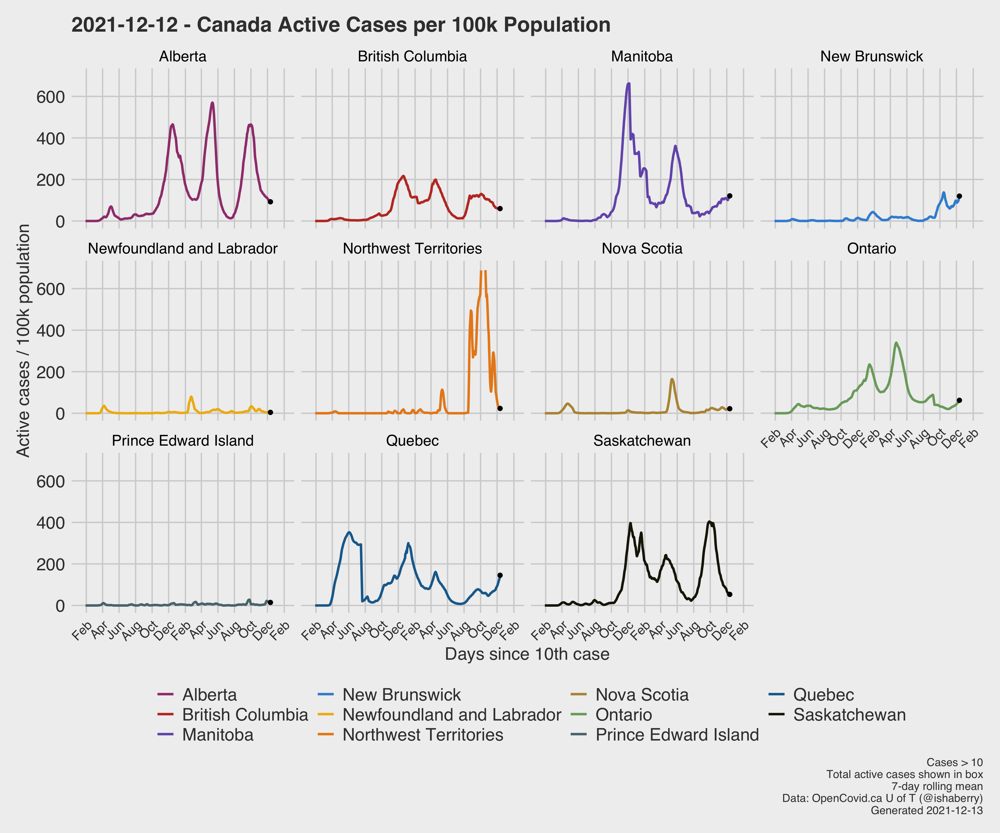
**Figure 6**: New daily cases versus days since 10th case. Daily cases are per 50k population.

## Canada Deaths ##

**Figure 7**: Per-province, time series of logy death counts. Black line is Canada. Per province sums shown on the right, although some overplotting of the values may occur when the values are close together.

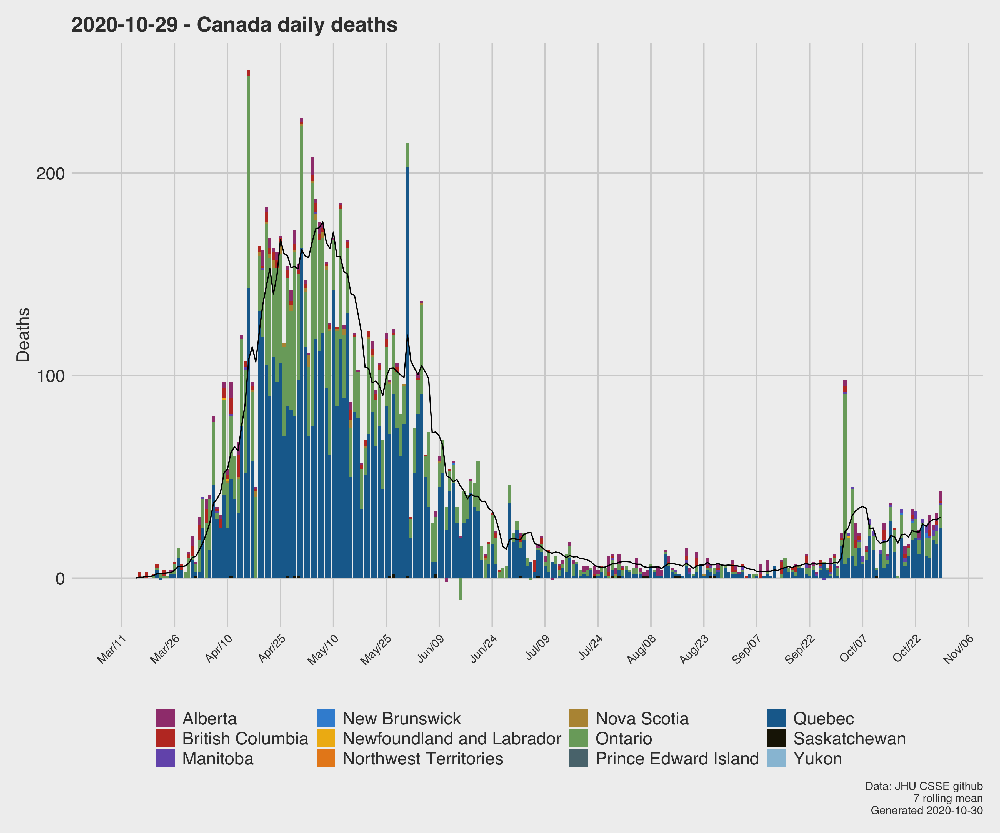
**Figure 8**: Per-province, daily deaths.

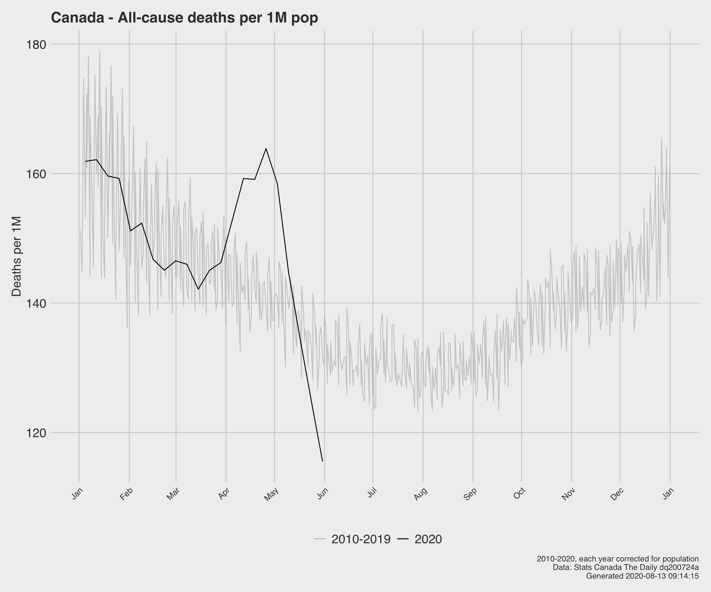
**Figure 9**: All-cause mortality for 2010-2019 (grey) and 2020 (black). Based on Stats Canada The Daily ["Provisional death counts and excess mortality, January 2019 to May 2020"](https://www150.statcan.gc.ca/n1/daily-quotidien/200724/dq200724a-eng.htm)

## Normalized ##

Normalized plots allow for more readily understanding the timing and relative impact of events (e.g., case rise and resulting deaths). Each province is normalized against that provinces peak daily death and peak daily new case count. 

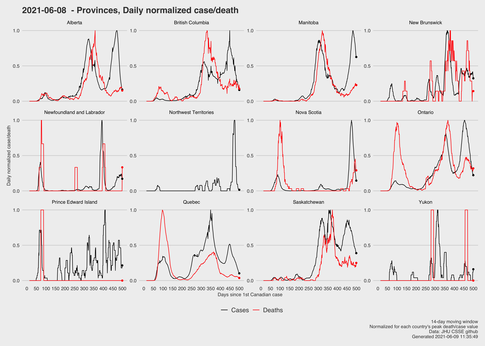
**Figure 10**: Death and cases values normalized against each respective peak, per province. 7-day rolling mean.

## Province
### Saskatchewan ###

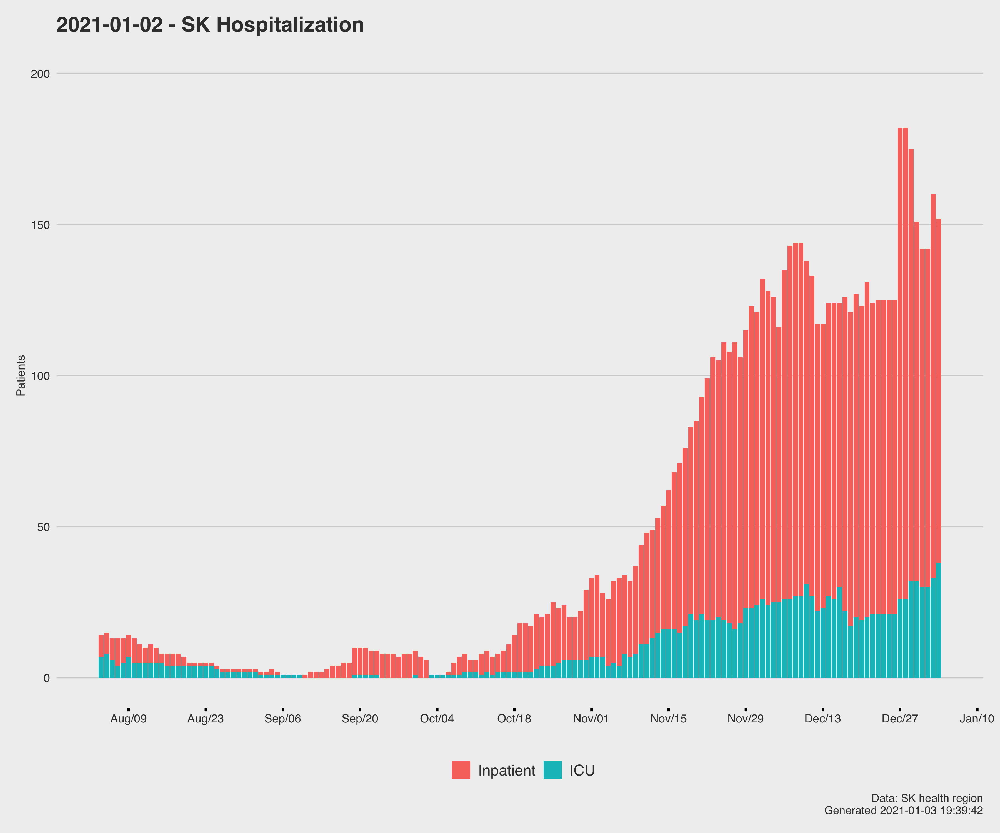
**Figure 11**: Inpatient and ICU patient numbers.

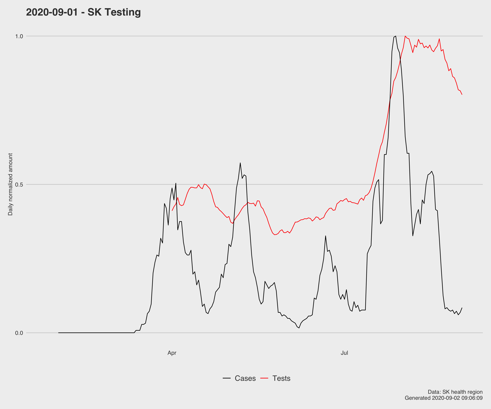
**Figure 12**: Normalized testing and total number of positive cases.

SaskHealth does not (seem to?) report test positivity. As testing increases, this is useful to determine if increased testing is catching more asymptomatic cases that before. Dividing total positive/total tests misses the temporal correlation of tests and cases, nor does it correctly attribute those with multiple negative tests. Thus, the below is a very crude proxy where a 7-day mean of new cases and tests is divided for the test positivity rate. 

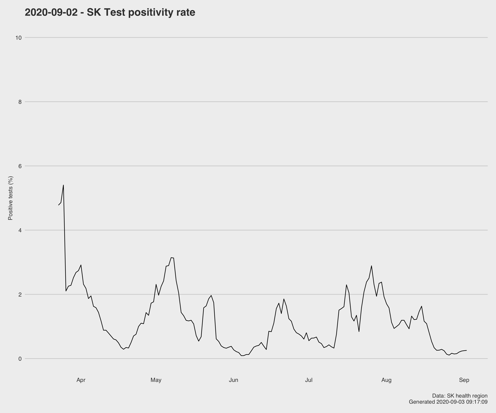
**Figure 13**: Crude proxy for test positivity rate. See above.

# Global
A subset of global countries are included so-as to ensure clear communication of data. 

**Figure 14**: Global logy growth  of reported infected cases. Reference growth rates expressed as days to double are shown. Cases are shown as days since the 100th reported case. 

**Figure 15**: Global time series of logy death counts. Per province sums shown on the right, although some overplotting of the values may occur when the values are close together.

**Figure 16**: Rate of change of the global death rate, expressed percentage growth. Computed as a 10-day moving window. The reference 2% rate is approximately South Korea's rate.

**Figure 17**: 10-day moving window rate of change of growth for select countries. The reference 2% rate is approximately South Korea's rate.

**Figure 18**: New weekly case growth versus cumulative growth. Deviation from linear line suggests a move from exponential growth.

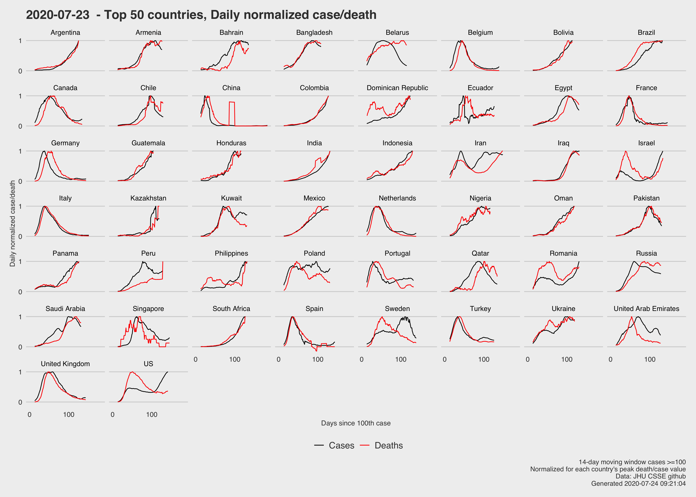
**Figure 19**: Top 50 countries (by total cases). Deaths and cases are normalized against that countries peak value (deaths/cases seperate). 1 = the worst that country has seen.

# US

The top 5 states (including Idaho due to a personal friend living there) are plotted, and these selected for deaths.

These data are from the New York Times github repository:

https://github.com/nytimes/covid-19-data

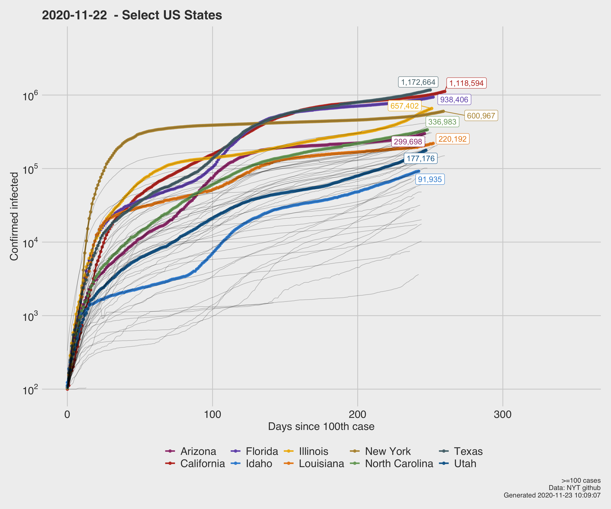
**Figure 20**: Top 5 states (w.r.t case load),incl Idaho. Growth of reported infected cases. Reference growth rates expressed as days to double are shown. Cases are shown as days since the 100th reported case. 

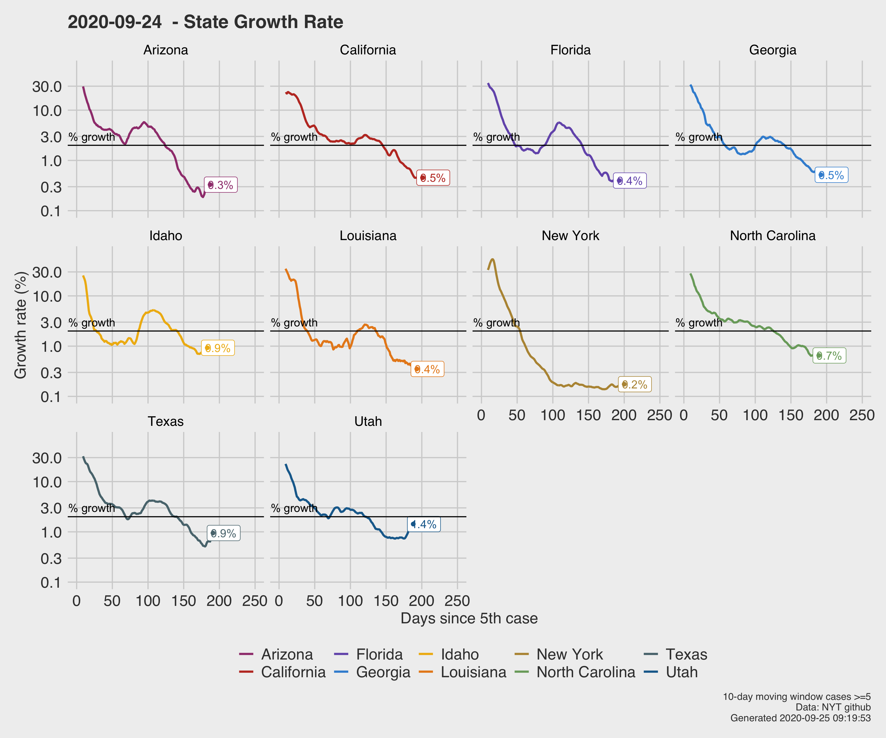
**Figure 21**: Top 5 states (w.r.t case load), incl Idaho. 10-day moving window rate of change of growth for select states. 

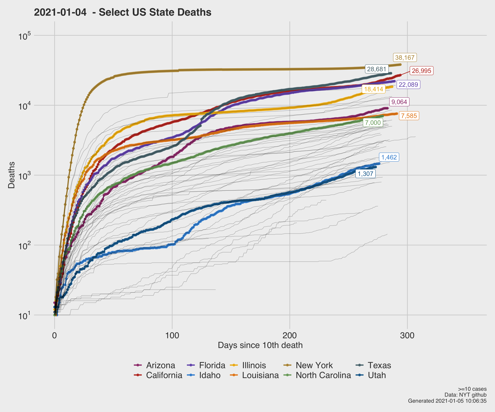
**Figure 22**: Top 5 states (w.r.t case load), incl Idaho. Growth of reported deaths. Reference growth rates expressed as days to double are shown. Deaths are shown as days since the 10th reported death. 

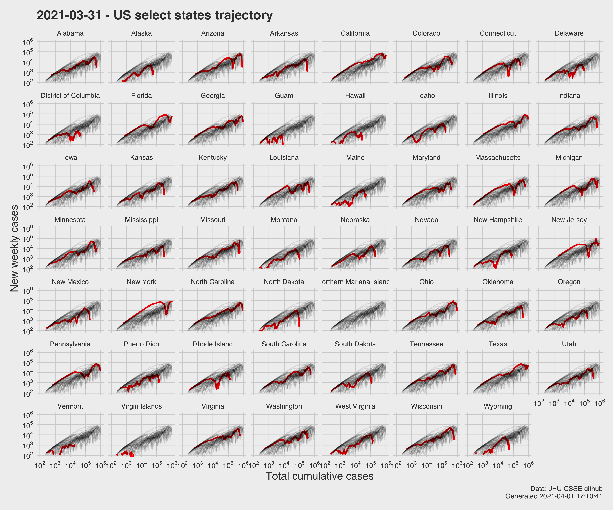
**Figure 23**: New weekly case growth versus cumulative growth. Deviation from linear line suggests a move from exponential growth.

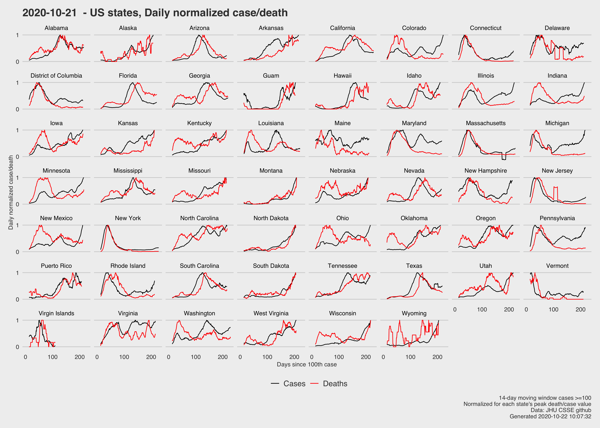
**Figure 24**: Deaths and cases are normalized against that state's peak value (deaths/cases seperate). 1 = the worst that state has seen.

**Figure 25**: Daily deaths, colored for top 11 states. These are the top 11 states that have the absolute greatest deaths/day.

