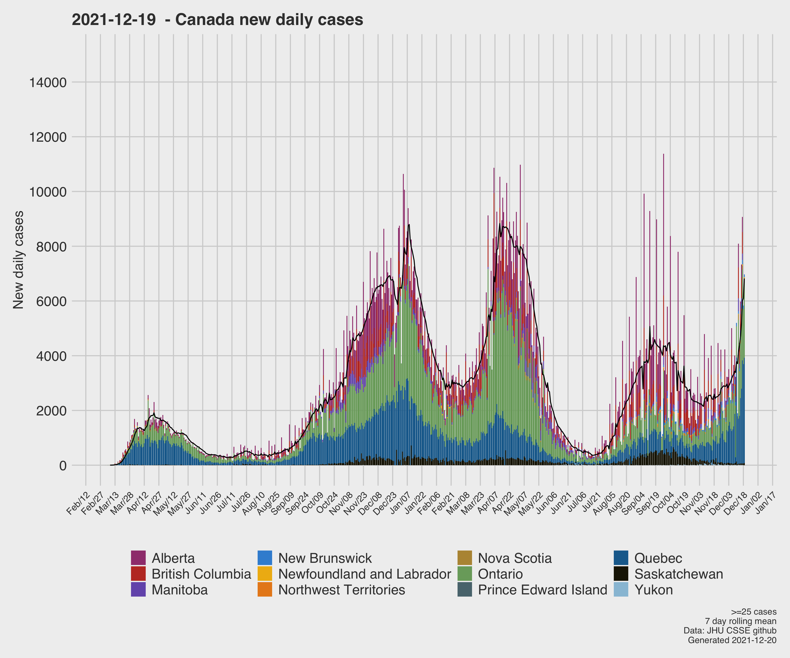

# COVID19
A Canada-first breakdown and analysis of the COVID19 pandemic. The data are from John-Hopkins University CSSE. Data are updated at UTC+0 daily. These plots thus reflect the previous day's complete data. This date is in the title with the date generated in the footer.

https://github.com/CSSEGISandData/COVID-19

List of figures:
- [Canada](#canada)
- [Global](#global)
- [Rate of change analysis](#growth)
- [United States](#US)

# [Canada](#canada)

**Figure 1**: Per-province, logy growth of reported infected cases. Reference growth rates expressed as days to double are shown. Cases are shown as days since the 5th reported case. 

**Figure 2**: Time series of logy growth of reported infected cases. Black line is Canada. Per province sums shown on the right, although some overplotting of the values may occur when the values are close together.

**Figure 3**: Time series of daily reported infected cases, per-province. 

As provinces' growth rates slow and hasten, the rate of change of these rates can be useful for quantifying if the situation is getting better or worse.

This below figure shows a 10-day moving window calculation of the growth rate of covid19 cases, expressed as days to double. The flagged dates are the dates of lockdown.

Specifically, a linear fit to `log(value)`  is calculated using a 10-day moving window. The slope of this line is expressed as a doubling rate via `log(2)/log(slope)`. This is then plotted with time. It's essentially the change in time of a moving window first derivative. The moving window approach is used to help filter out some of the noise in data, e.g., when there is no reporting over weekends, etc.

**Figure 4**: 10-day moving window rate of change of growth for provinces. Greater doubling rates implies a slow down.

## Canada Deaths ##

**Figure 5**: Per-province, time series of logy death counts. Black line is Canada. Per province sums shown on the right, although some overplotting of the values may occur when the values are close together.

# [Global](#global)
A subset of global countries are included so-as to ensure clear communication of data. 

These are currently: Canada, France, Italy, Spain, UK, US

**Figure 6**: Global logy growth  of reported infected cases. Reference growth rates expressed as days to double are shown. Cases are shown as days since the 100th reported case. 

**Figure 7**: Global time series of logy death counts. Per province sums shown on the right, although some overplotting of the values may occur when the values are close together.

# [Global change in rate of growth](#growth)

As countries' growth rates slow and hasten, the rate of change of these rates can be useful for quantifying if the situation is getting better or worse.

This below figure shows a 10-day moving window calculation of the growth rate of covid19 cases, expressed as days to double. The flagged dates are the dates of lockdown.

Specifically, a linear fit to `log(value)`  is calculated using a 10-day moving window. The slope of this line is expressed as a doubling rate via `log(2)/log(slope)`. This is then plotted with time. It's essentially the change in time of a moving window first derivative. The moving window approach is used to help filter out some of the noise in data, e.g., when there is no reporting over weekends, etc.

**Figure 8**: 10-day moving window rate of change of growth for select countries. Greater doubling rates implies a slow down.

# [US](#US)

The top 5 states (including Idaho due to a personal friend living there) are plotted, and these selected for deaths.

These data are from the New York Times github repository:

https://github.com/nytimes/covid-19-data

**Figure 9**: Top 5 states (w.r.t case load),incl Idaho. Growth of reported infected cases. Reference growth rates expressed as days to double are shown. Cases are shown as days since the 100th reported case. 

**Figure 10**: Top 5 states (w.r.t case load), incl Idaho. Growth of reported deaths. Reference growth rates expressed as days to double are shown. Deaths are shown as days since the 10th reported death. 

