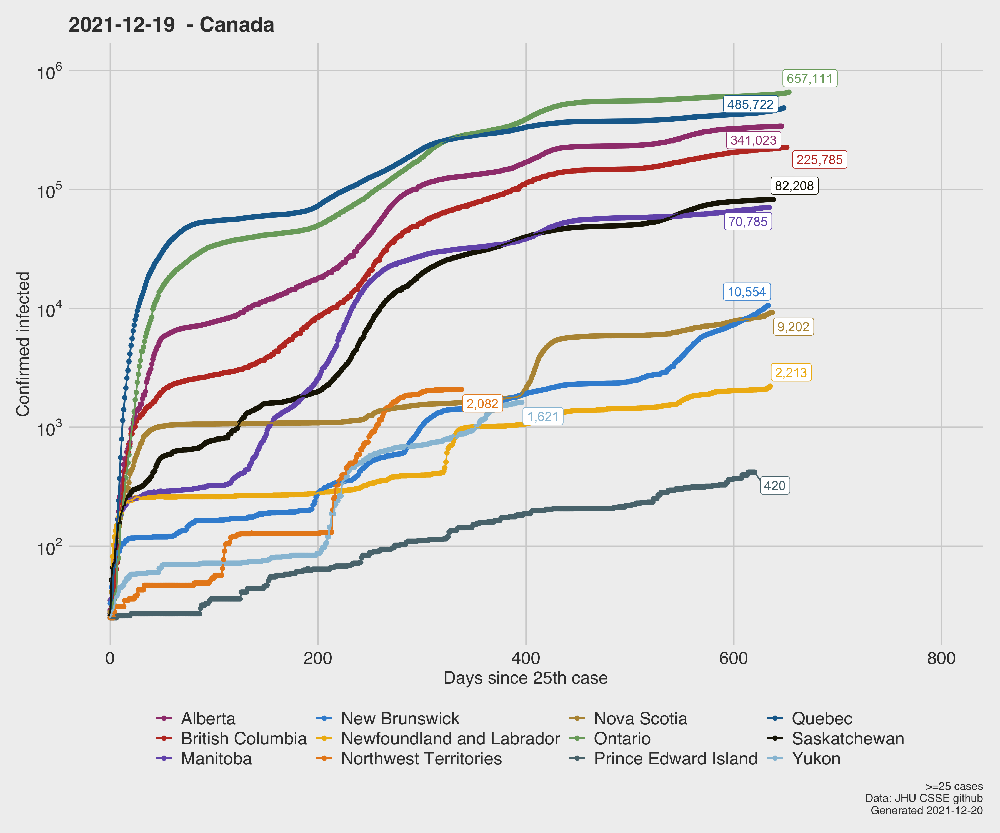
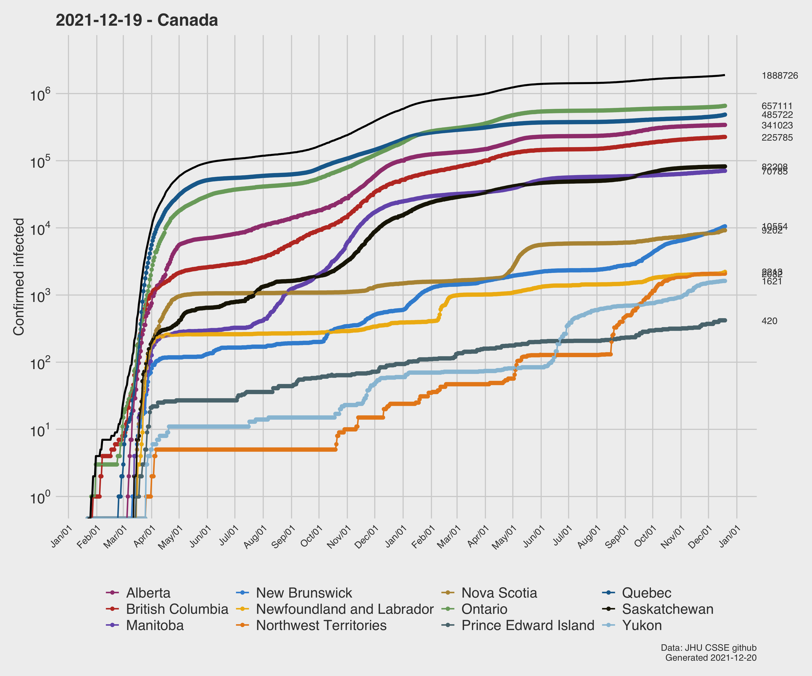
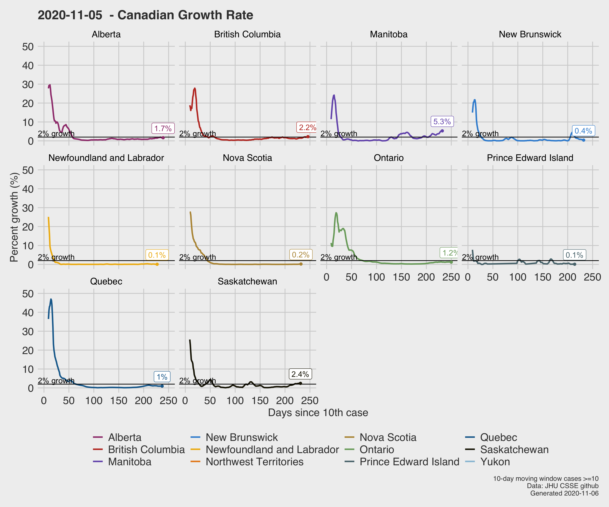
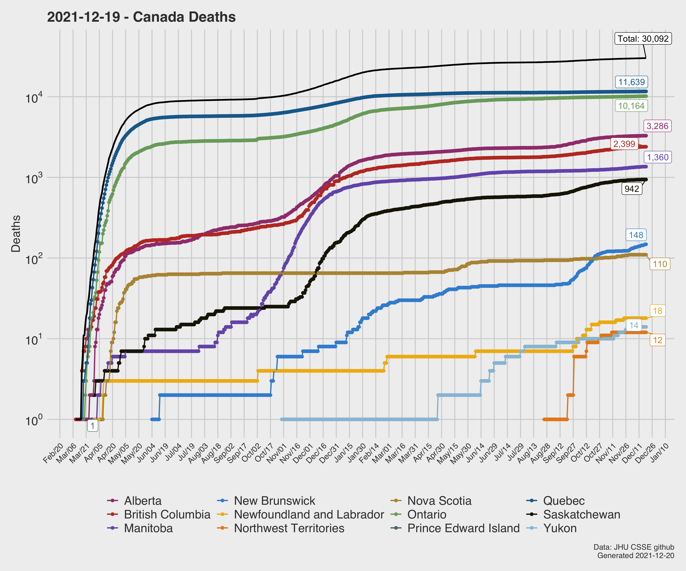
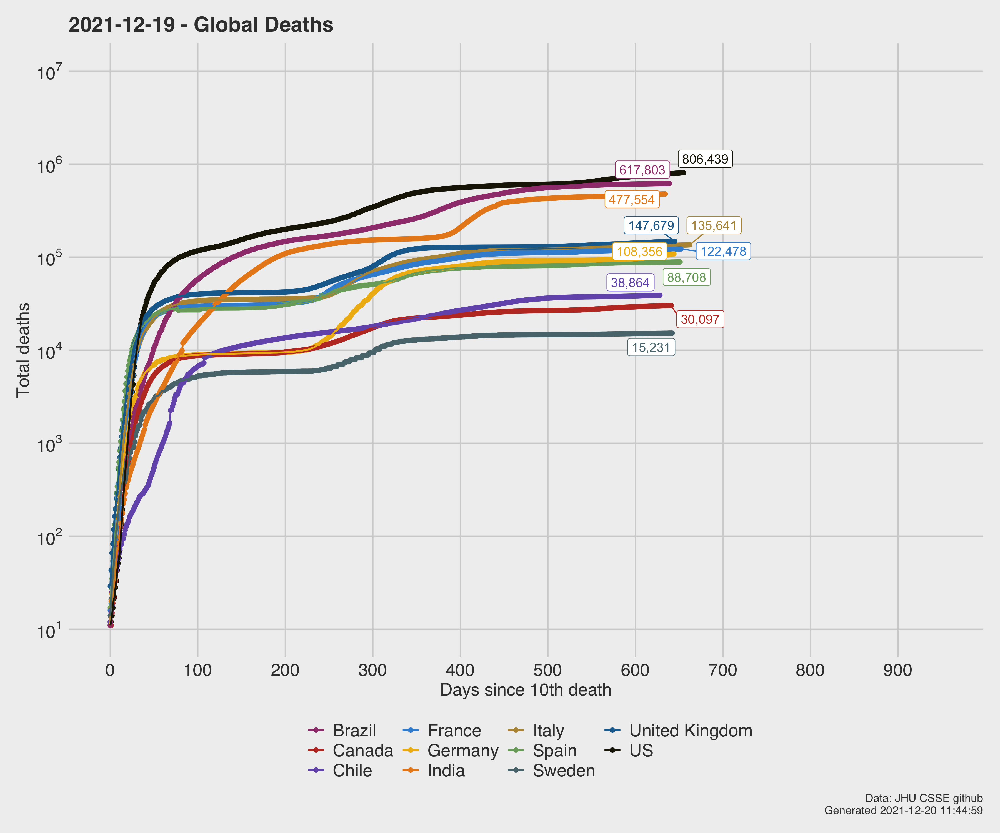
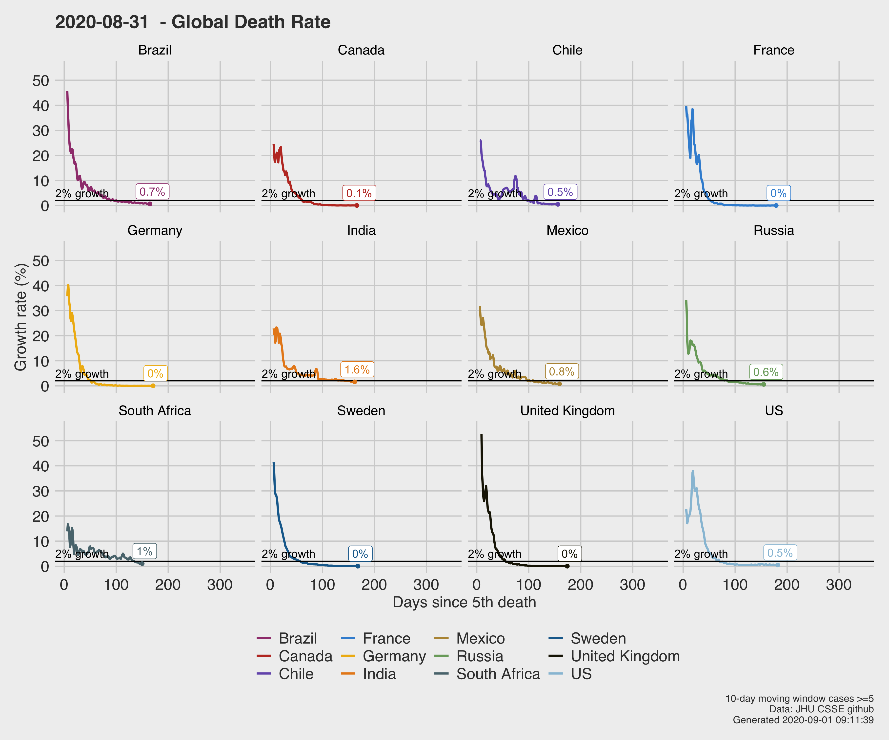
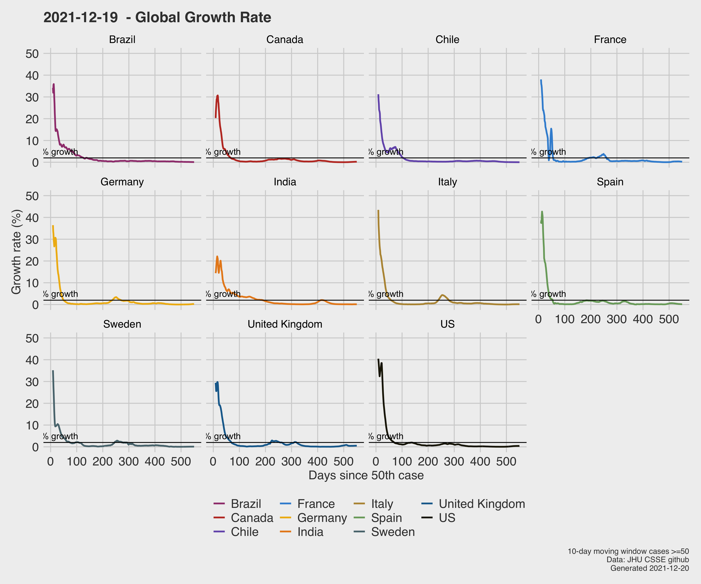
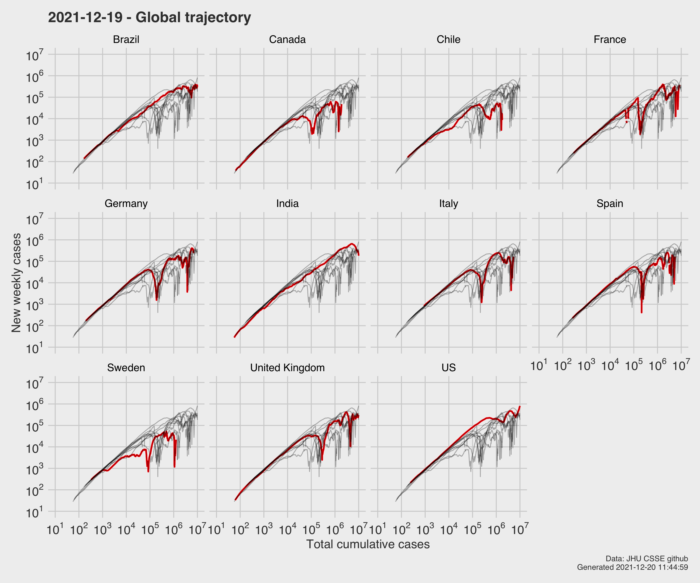

# COVID19
A Canada-first breakdown and analysis of the COVID19 pandemic. The data are from John-Hopkins University CSSE. Data are updated at UTC+0 daily. These plots thus reflect the previous day's complete data. This date is in the title with the date generated in the footer.

https://github.com/CSSEGISandData/COVID-19

List of figures:
- [Canada](#canada)
- [Global](#global)
- [Rate of change analysis](#growth)
- [United States](#US)

# [Canada](#canada)

**Figure 1**: Per-province, logy growth of reported infected cases. Reference growth rates expressed as days to double are shown. Cases are shown as days since the 5th reported case. 

**Figure 2**: Time series of logy growth of reported infected cases. Black line is Canada. Per province sums shown on the right, although some overplotting of the values may occur when the values are close together.

**Figure 3**: Time series of daily reported infected cases, per-province. 

As provinces' growth rates slow and hasten, the rate of change of these rates can be useful for quantifying if the situation is getting better or worse.

This below figure shows a 10-day moving window calculation of the growth rate of covid19 cases, expressed as a percentage growth rate. 

Specifically, a linear fit to `log(value)`  is calculated using a 10-day moving window. The slope of this line is expressed as a doubling rate via `log(2)/log(slope)`.  The days to double are then converted to a growth rate in percentage. This is then plotted with time. It's essentially the change in time of a moving window first derivative. The moving window approach is used to help filter out some of the noise in data, e.g., when there is no reporting over weekends, etc.

**Figure 4**: 10-day moving window rate of change of growth for provinces. The reference 2% rate is approximately South Korea's rate.

A method to detect if a country/province has fallen off the exponential growth part of a logistic curve was suggested by [Minute Physics "How To Tell If We're Beating COVID-19"](https://www.youtube.com/watch?v=54XLXg4fYsc). The idea is if an area is currently following exponential growth, then the new daily cases as well as the cumulative cases both will increase exponentially. Plotting the two against each other, on log axes, results in a straight line. Thus, if the daily case growth is no longer exponential, there is a deviation from this straight line. In this case, weekly growth is used to help filter out the sampling noise.

**Figure 5**: New weekly case growth versus cumulative growth. Deviation from linear line suggests a move from exponential growth.

## Canada Deaths ##

**Figure 6**: Per-province, time series of logy death counts. Black line is Canada. Per province sums shown on the right, although some overplotting of the values may occur when the values are close together.

# [Global](#global)
A subset of global countries are included so-as to ensure clear communication of data. 

**Figure 7**: Global logy growth  of reported infected cases. Reference growth rates expressed as days to double are shown. Cases are shown as days since the 100th reported case. 

**Figure 8**: Global time series of logy death counts. Per province sums shown on the right, although some overplotting of the values may occur when the values are close together.

**Figure 9**: Rate of change of the global death rate, expressed percentage growth. Computed as a 10-day moving window. The reference 2% rate is approximately South Korea's rate.

# [Global rate of growth](#growth)

**Figure 10**: 10-day moving window rate of change of growth for select countries. The reference 2% rate is approximately South Korea's rate.

**Figure 11**: New weekly case growth versus cumulative growth. Deviation from linear line suggests a move from exponential growth.

# [US](#US)

The top 5 states (including Idaho due to a personal friend living there) are plotted, and these selected for deaths.

These data are from the New York Times github repository:

https://github.com/nytimes/covid-19-data

**Figure 12**: Top 5 states (w.r.t case load),incl Idaho. Growth of reported infected cases. Reference growth rates expressed as days to double are shown. Cases are shown as days since the 100th reported case. 

**Figure 13**: Top 5 states (w.r.t case load), incl Idaho. Growth of reported deaths. Reference growth rates expressed as days to double are shown. Deaths are shown as days since the 10th reported death. 

